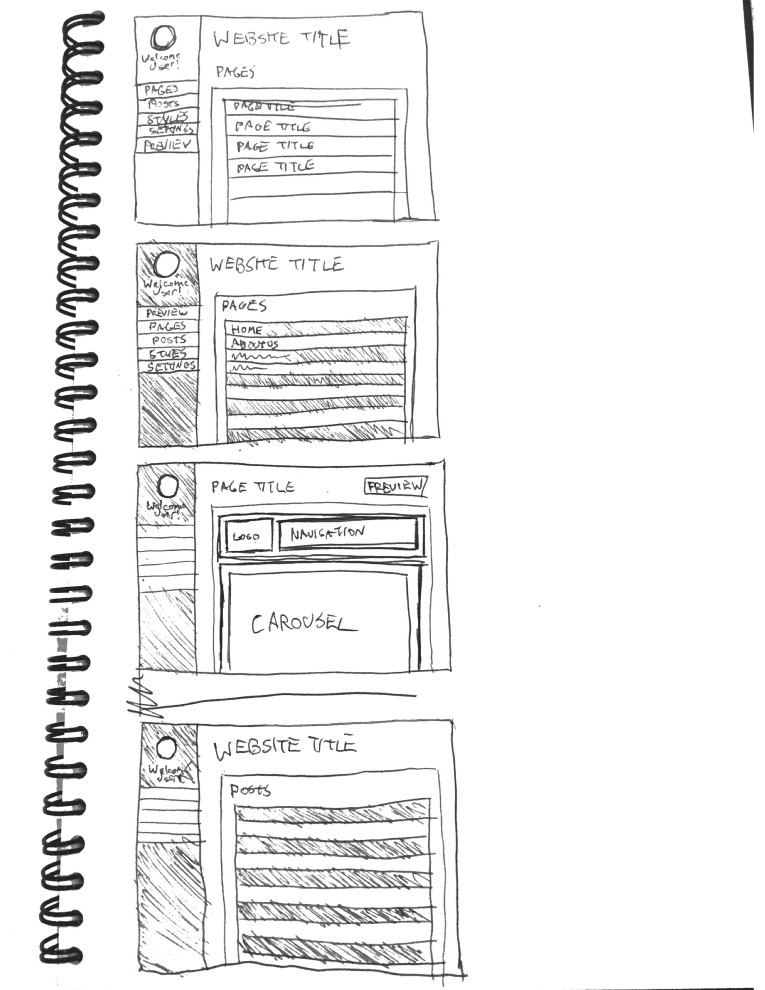

# project3-cms-front-end

This is a Content Management System Front end created by Scott Davidson, Grace Kamau and Alex Jones.
   
  In this app, a user can create, edit and delete a blog and a web page.

<h2>Technologies used are:</h2>
<ul>
  <li> <h3> Node modules:</h3>
      <li> Node.js is an open-source application for developing server-side web applications. Node apps are written in JavaScript. </li>
      <li>A large percentage of the basic modules are written in JavaScript. </li>
      <li>Node.js contains a built-in library to allow applications to act as a stand-alone web server. </li>
    </ul>
  </li>

<li> <h3> Express: </h3>
  <ul>
    <li>EXPRESS is a standard data modeling language for product data.</li>
    <li>EXPRESS is a data modeling language defined in ISO 10303-11. </li>
  </ul>
</li>

<li> <h3> Passport </h3>
  <ul>
    <li>Passport is authentication middleware for Node.js.  </li>
    <li>Passport delegates all other functionality to the application. This separation of concerns keeps code clean and maintainable, and makes Passport extremely easy to integrate into an application. </li>
    <li>Passport recognizes that each application has unique authentication requirements. Authentication mechanisms, known as strategies, are packaged as individual modules. Applications can choose which strategies to employ(e.g. username and password, Facebook, Twitter, and more.), without creating unnecessary dependencies. </li>
  </ul>
</li>

<li> <h3> Bootstrap </h3>
  <ul>
    <li>Bootstrap, originally named Twitter Blueprint, was developed by Mark Otto and Jacob Thornton at Twitter as a framework to encourage consistency across internal tools.</li>
  </ul>

</li>

<li> <h3> Handlebars </h3>
  <ul>
    <li>Handlebars is a semantic web template system, started by Yehuda Katz in 2010.</li>
    <li>Handlebars.js is a superset of Mustache, and can render Mustache templates in addition to Handlebars templates.</li>
    <li>While Mustache is a logicless templating language, Handlebars adds extensibility and minimal logic, such as #if, #unless, #with, and #each helpers.</li>
  </ul>
</li>

<li> <h3> Mongoose </h3>
  <ul>
    <li>Mongoose is used for elegant mongodb object modeling for node.js </li>
    <li>Mongoose provides a straight-forward, schema-based solution to model application data.</li>
    <li>It includes built-in type casting, validation, query building, business logic hooks etc. </li>
  </ul>
</li>

<li> <h3>mongo DB</h3>
  <ul>
    <li>It is a cross-platform document-oriented database.</li>
    <li>Classified as a NoSQL database, MongoDB eschews the traditional table-based relational database structure in favor of JSON-like documents with dynamic schemas (MongoDB calls the format BSON), making the integration of data in certain types of applications easier and faster. </li>
    <li>MongoDB is free and open-source software. </li>
  </ul>
</li>

<li> <h3> jQuery</h3>
  <ul>
    <li>jQuery is a cross-platform JavaScript library designed to simplify the client-side scripting of HTML. </li>
    <li>jQuery's syntax is designed to make it easier to navigate a document, select DOM elements, create animations, handle events, and develop Ajax applications. </li>
    <li> jQuery is free, open-source software licensed under the MIT License.</li>
  </ul>
</li>

<li> <h3>Java Script</h3>
  <ul>
    <li>JavaScript is a high-level, dynamic, untyped, and interpreted programming language.</li>
    <li>Alongside HTML and CSS, it is one of the three essential technologies of World Wide Web content production; the majority of websites employ it and it is supported by all modern web browsers without plug-ins. </li>
    <li>JavaScript is prototype-based with first-class functions, making it a multi-paradigm language, supporting object-oriented, imperative, and functional programming styles.</li>
  </ul>
</li>
</ul>

<h2>Approach taken when workig on this project</h2>

  <ul>
    <li>Our team first focused on creating the user module and made sure that the Register, login and logout code works for the user module. </li>
    <li>Next we created the blogs routes and made sure all the routes were working using postman. </li>
    <li> </li>
  </ul>

<h2> Unsolved problems or major hurdles your team had to overcome </h2>

We worked really well as a team, and were able to meet all the project requirements.

<h2>Installation instructions for any dependencies.</h2>

 This app is deployed online and no installation is required.

<h2> user stories</h2>

  <h3>BASIC USER STORIES</h3>
    <h4> Pages</h4>
    <ul>
      <li>As an admin: (Person can edit and add pages)</li>
      <li> Add text content to the page </li>
      <li> Edit a page </li>
      <li> Delete a page </li>
      <li> View or list a page </li>
      <li> See when a page was last edited.</li>
    </ul>

    <h4> Blog Posts</h4>
    <ul>
      <li>As an admin: (Person can edit and add blogs)</li>
      <li> Add text content to the blog </li>
      <li> Edit a blog </li>
      <li> Delete a blog </li>
      <li> View or list a blog </li>
      <li> See when a blog was last edited.</li>
    </ul>

<h2> ERD - data models used in this app</h2>

  <ul>
    <li>MongoDB uses Document Oriented Storage in JSON-style documents. </li>
    <li>Mongoose is an object relational modeling (ORM) system that bridges Node.js and MongoDB.  </li>
  </ul>
  <ul>
    <li>User: A user can author many posts and create many pages. </li>
    <li>Post: A post has a single author, a single main image, and is placed into a single category. </li>
    <li>Page: A page has a single author, a single main image, and is placed into a single category. </li>
  </ul>

<h2> Wireframes </h2>

<h3>Deployed front-end app:</h3> 

<h3>Repository of this app's back-end:</h3> https://github.com/gracenjambi/project3-cms-back-end

